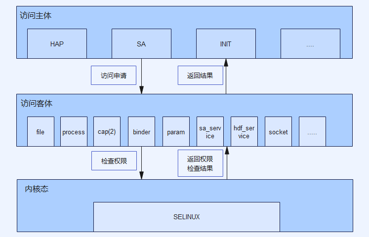

# security_selinux

## 目标

SELinux （安全增强式 Linux ， Security-Enhanced Linux ）是 Linux 历史上杰出的安全子系统。 SELinux SIG 的工作目标是将 SELinux 引入 OpenHarmony 。

> 1. SELinux 是一组内核修改和用户空间工具，其提供了访问控制安全策略机制，包括了强制访问控制（ Mandatory Access Control ， MAC ）。
> 2. SELinux 已经被添加到各种 Linux 发行版中。其软件架构力图将安全决策的执行与安全策略分离，并简化涉及执行安全策略的软件的数量。

## 仓库

涉及到的仓库有以下几个：

| 仓库 | 源码目录 | 说明 |
| --- | --- | --- |
| [security_selinux](https://gitee.com/openharmony/security_selinux.git) | `base/security/selinux/` | 策略和一些自研接口 |
| [third_party_selinux](https://gitee.com/openharmony/third_party_selinux.git) | `third_party/selinux/` | SELinux 的主仓库 |
| [productdefine_common](https://gitee.com/openharmony/productdefine_common.git) | `productdefine/common/` | 添加 SELinux 组件定义 |
| [third_party_toybox](https://gitee.com/openharmony/third_party_toybox.git) | `third_party/toybox/` | 完善了 `ls` 的 SELinux 支持 |
| [startup_init_lite](https://gitee.com/openharmony/startup_init_lite.git) | `base/startup/init_lite/` | 系统启动加载策略并分化服务的标签 |
| [third_party_FreeBSD](https://gitee.com/openharmony/third_party_FreeBSD.git) | `third_party/FreeBSD/` | 提供 fts 库 |
| [third_party_pcre](https://gitee.com/openharmony/third_party_pcre2.git) | `third_party/pcre/` | 提供 pcre2 库 |
| [build](https://gitee.com/openharmony/build.git) | `build/` | 编译控制 |

## 架构

### 整体架构



在 [third_party_selinux](https://gitee.com/openharmony/third_party_selinux.git) 中使用了下面四个 SELinux 的组件：

| 组件 | 来源 | 作用 | 形式 |
| --- | --- | --- | --- |
| `checkpolicy/` | [selinux/checkpolicy](https://github.com/SELinuxProject/selinux/tree/cf853c1a0c2328ad6c62fb2b2cc55d4926301d6b/checkpolicy) | `checkpolicy` | 可执行文件 |
| `libselinux/` | [selinux/libselinux](https://github.com/SELinuxProject/selinux/tree/cf853c1a0c2328ad6c62fb2b2cc55d4926301d6b/libselinux) | `libselinux.so`、`getenforce`、`setenforce` | 动态库 |
| `libsepol/` | [selinux/libsepol](https://github.com/SELinuxProject/selinux/tree/cf853c1a0c2328ad6c62fb2b2cc55d4926301d6b/libsepol) | 提供内部使用的 API | 动态库 |
| `seclic/` | [selinux/seclic](https://github.com/SELinuxProject/selinux/tree/cf853c1a0c2328ad6c62fb2b2cc55d4926301d6b/secilc) | `seclic` | 可执行文件 |

> 本仓库主要位于图中的编译侧，在板侧有两个动态库供 init 调用三方库。

### 目录结构

```
.
├── config                  # 板侧    三方库配置文件
├── docs                    #         文档资源
│   └── images
├── interfaces
│   ├── policycoreutils     # 板侧    libload_policy.so、librestorecon.so
│   │   ├── include
│   │   └── src
│   └── tools               # 板侧    load_policy、restorecon
│       ├── load_policy
│       └── restorecon
├── scripts                 # 编译侧  策略编译脚本
├── sepolicy                # 编译侧  策略文件
└── test                    #         测试程序
```

## 验证

### 编译代码

1. 根据文档[《获取源码》](https://gitee.com/openharmony/docs/blob/master/zh-cn/device-dev/quick-start/quickstart-standard-sourcecode-acquire.md)获取主线代码。
1. 根据文档[《源码编译》](https://gitee.com/openharmony/docs/blob/master/zh-cn/device-dev/quick-start/quickstart-standard-running-hi3516-build.md)编译主线代码。

### 编译镜像

运行以下命令编译打包支持 SELinux 的镜像：

selinux当前仅支持RK3568设备
```
本模块单独编译命令
./build.sh --product-name=rk3568 -T selinux --ccache
```
### 运行验证

将镜像烧录到开发板上，开机，通过串口拿到 Shell ，在其中执行：

```
ls -lZ /         # 查看文件标签
ls -lLZ /        # 查看link源文件标签
ps -eZ           # 查看进程标签
setenforce 1     # 使能selinux强制模式
setenforce 0     # 是能selinux宽容模式,当前默认宽容模式
getenforce       # 获取selinux工作模式
```
策略文件            /etc/selinux/targeted/policy/policy.31

文件标签规则        /etc/selinux/targeted/policy/file_contexts

selinux模式开关     /etc/selinux/config

验证时，可单独替换上述文件。

### 日志信息

```
audit: type=1400 audit(1502458430.566:4): avc:  denied  { open } for  pid=1658 comm="setenforce" path="/sys/fs/selinux/enforce" dev="selinuxfs" ino=4 scontext=u:r:hdcd:s0 tcontext=u:object_r:selinuxfs:s0 tclass=file permissive=1

日志解读
open                                #操作为open
pid=1658                            #访问主体进程号为1658
comm="setenforce"                   #访问主体进程名为setenforce
path="/sys/fs/selinux/enforce"      #被访问客体为/sys/fs/selinux/enforce
dev="selinuxfs"                     #被访问文件属于selinuxfs这一文件系统
ino=4                               #文件节点编号为4
scontext=u:r:hdcd:s0                #访问主体selinux标签为u:r:hdcd:s0
tcontext=u:object_r:selinuxfs:s0   #被访问客体selinux标签为u:object_r:selinuxfs:s0
tclass=file                         #当前告警属于file类型的操作
permissive=1                        #当前selinux处于宽容模式，只告警不做访问拦截。强制模式时，做拦截， permissive=0
```

### 策略编写

```
根据avc告警，获取访问信息
如：
audit: type=1400 audit(1502458430.566:4): avc:  denied  { open } for  pid=1658 comm="setenforce" path="/sys/fs/selinux/enforce" dev="selinuxfs" ino=4 scontext=u:r:hdcd:s0 tcontext=u:object_r:selinuxfs:s0 tclass=file permissive=1
对应规则为
allow hdcd selinuxfs:file open;
```
